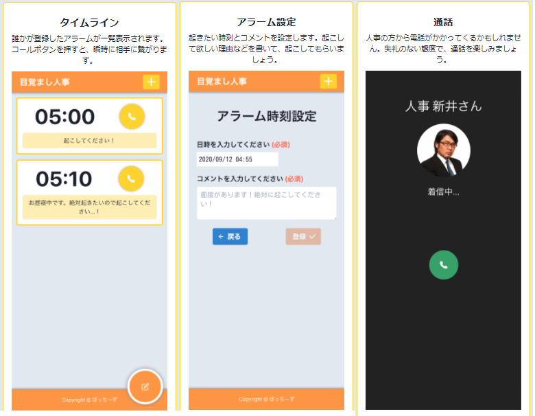
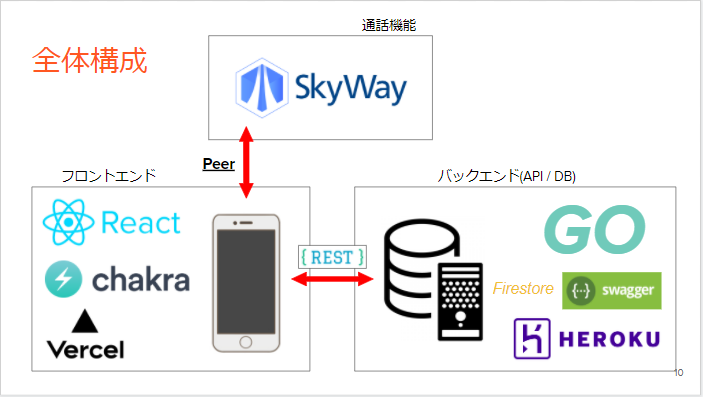

# Open Hack U 2020 とは

[Open Hack U](https://hacku.yahoo.co.jp/2020/)はヤフーが主催する学生向けのハッカソンです．  
個人エントリーで参加し，他の個人エントリーの人たちと 6 人で「ぼっちーず」というチームを組みました．

私たちが制作したプロダクトは「目覚まし人事」です．
<https://mezamashi-jinji.vercel.app/>

# 目覚まし人事とは

ユーザーがお互いにモーニングコールをできる WEB アプリです．  
就活生なら経験したことがあるかもしれない，人事から電話がかかってくるという緊張感(社会人の人なら怖い上司を思い浮かべてください)  
この緊張感を利用した電話型目覚まし時計です．

電話をかけるユーザは，人事になりきって通話してみるとよりリアリティが増します．  
万が一，誰も起こしてくれなくても時間になればシステムが自動的に起こしてくれます．

# 使用技術

# 担当箇所

★ タイムライン画面とアラーム設定画面の UI デザイン (Figma)  
★ タイムライン画面とアラーム設定画面の UI の実装 (React)  
★ 着信音の実装 (React)

詳しくは[note](https://note.com/_naa_/n/n6f22e3062f99)へ

# 資料

Open Hack U 2020 Online Vol.3 プレゼンテーション・作品展示会・表彰式：<https://www.youtube.com/watch?v=tdewmH9IBqw&feature=youtu.be>  
プレゼン資料：<https://docs.google.com/presentation/d/1ieVzFhQ4WNt9NGSOkKjPzE-RwPZE4H6MeV_67N7D2Xo/edit#slide=id.p>  
note (個人的な所感)：<https://note.com/_naa_/n/n6f22e3062f99>
