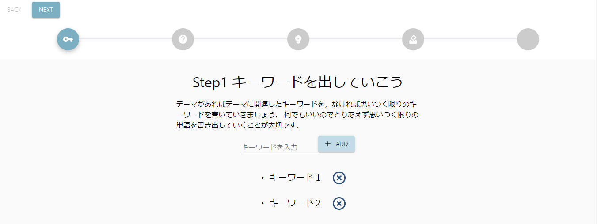

# Open Hack U 2020 とは

[Open Hack U](https://hacku.yahoo.co.jp/2020/)はヤフーさんが主催する学生向けのハッカソンです．  
Twitter の呼びかけで集まった 5 人で「G-lab」というチームを結成し，参加しました．

# Hackathon Supporter とは

私たちが制作したプロダクトは「Hackathon Supporter」です．  
<https://hacku-front.herokuapp.com/>

「Hackathon Supporter」はチュートリアルに沿って進めるだけでアイデア出しを進められる，アイデア出しに特化したハッカソンサポートアプリです．

「ハッカソンで中々アイデア出しが進まない」「そもそもどうやってアイデア出しをしていけばいいのかが分からない」そんな人たちのためのプロダクトとなっています．

私たち自身が Twitter で集まった人同士で初めましてのチームだったためにアイデア出しが全く進まなかったことから着想を得ています．
また，以前にあった Open Hack U のアイデア出し勉強会での流れを参考にして，もっとアプリを用いて進めやすいようしました．

まず，「Get Room ID」ボタンで ID を取得します．これをチームメンバーで共有することで同じ Room に入ることができます．
同じ Room に入ることでリアルタイムにページを同期し，変更を反映させることができます．

早速アイデア出しを進めていきます．まず，キーワード出しから始めていきます．どうしていけばいいかなどは全てアプリ内に記載されているので，書いている通りに進めていけば大丈夫です．

続いて，それぞれのキーワードに対して問題点を挙げていき，さらにその問題点に対する解決策を挙げていきます．

最終的に意思決定のための投票機能も付いています．

# 使用技術

# 担当箇所

フロントエンド担当  
★ UI デザイン (Figma)  
★ キーワード出し，問題点出し，解決策出しの画面を実装 (React)  
★ プレゼン

# こだわった点

・画面上部にステップを表示することで，工程数をあらかじめ分かるように  
・アプリを進めるだけでそのまま進められるようにチュートリアル感を意識  
・チーム内でリアルタイムに同期  
・投票機能

# 資料

Open Hack U 2020 Online Vol.4 プレゼンテーション・作品展示会・表彰式：<https://www.youtube.com/watch?time_continue=6&v=z8uqZBVOpVo&feature=emb_title>  
プレゼン資料：<https://speakerdeck.com/naa/open-hack-u-2020-vol-dot-4-fa-biao-zi-liao>  
ブログは後日書きます．
