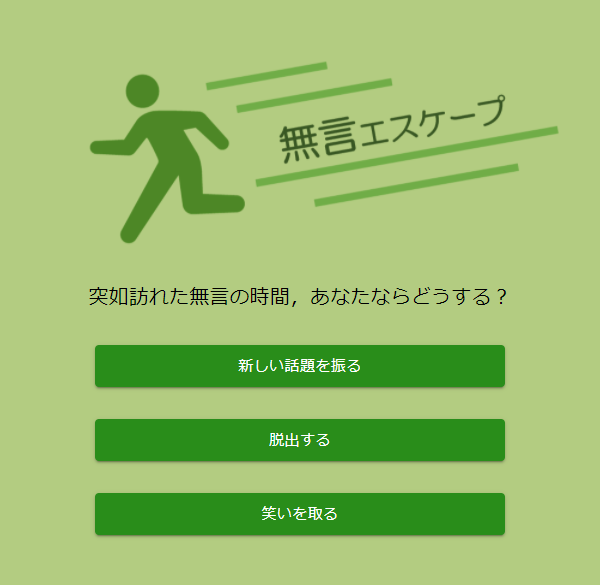
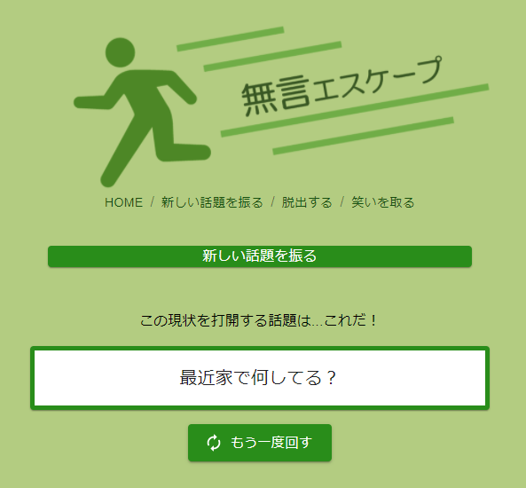
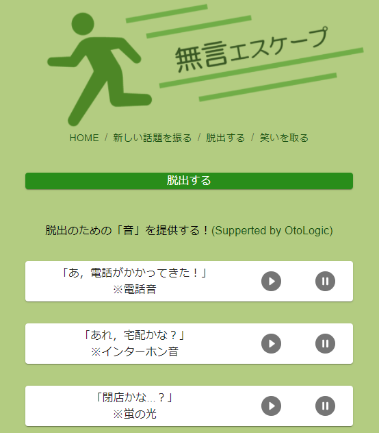
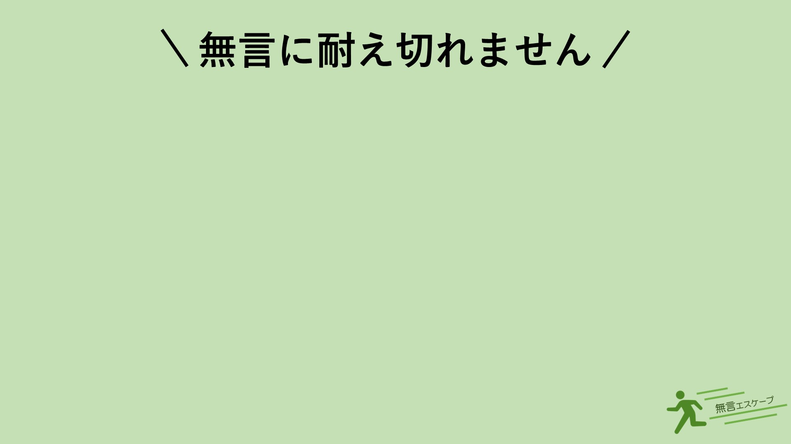
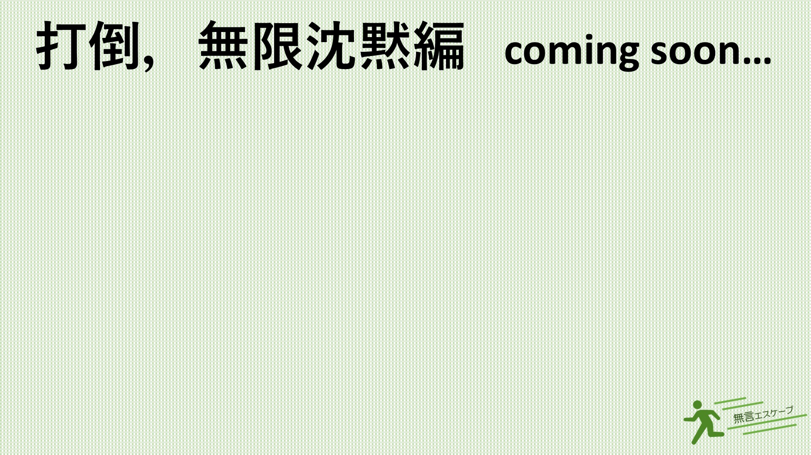
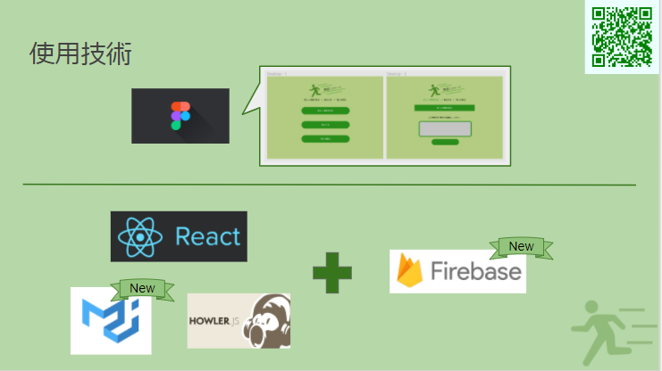

# ウインターハッカソンとは

[ウインターハッカソン](https://talent.supporterz.jp/events/c37a27fd-e763-4e2e-b037-a6f041048268/)はサポーターズさんと VOYAGE GROUP さんの 2 社共催のハッカソンです．  
個人参加という形で開発しました．

技術力が不安な人でも気軽に参加できる雰囲気で，ハッカソンが初めての人にはかなりおすすめのイベントです．

今回のテーマは「コロナ禍の年末年始が楽しくなるもの」でした．

今回の開催期間は 12 月 26 日・27 日で，18 日~25 日はハッカソン準備期間（事前開発可）でした．

私が制作したプロダクトは「無言エスケープ」です．  
<https://mugon-escape.web.app/>

今回，全 26 チームのなかで最優秀賞が 1 作品，入選が 4 作品選ばれましたが，入選作品の 1 つにこの「無言エスケープ」が選ばれました．

# 無言エスケープとは

コロナ禍でオンライン飲み会が増えた昨今，ふと会話が途切れて無言の気まずい時間が少なからず発生しているはず．  
その無言の時間から切り抜けたいあなたをサポートするのが，この「無言エスケープ」です．

具体的には「話題を提供する」「脱出する」「笑いを取る」の 3 つの方法でサポートをします．

まず 1 つ目，「話題を提供する」のをサポートする話題スロットです．スロットのように回して話題を決定することができます．コロナ関係など時事ネタを含めた 30 種類の話題をご用意しています．何度でもスロットを回すことができるので，気に入るものが出るまで回すことができます．

2 つ目は，その場から「脱出する」のをサポートする，オーディオ機能です．電話音・インターホン音・蛍の光の曲を出すことができます．例えば，電話音やインターホン音を鳴らすことで，「電話かな？」「宅配便かな？」といった風に抜け出しやすくなります．また，蛍の光の曲を流すことで，もう今日は終わりかなとい雰囲気させることができます.

3 つ目は，「笑いを取る」のをサポートする（？），受け狙いのバーチャル背景をダウンロードできる機能です．用意したバーチャル背景は以下の 2 つです．

# 使用技術

# 資料

プレゼン資料：<https://docs.google.com/presentation/d/1gWsJNISLcjqB-xOjQ2Q_3WNCV0lOzCmzJ_D7ZpU1BgY/edit?usp=sharing>

GitHub: <https://github.com/NatsukiH/WinterHackathon5>

詳しいことは全て note へ：<https://note.com/_naa_/n/n81ae71e9f5ba>
