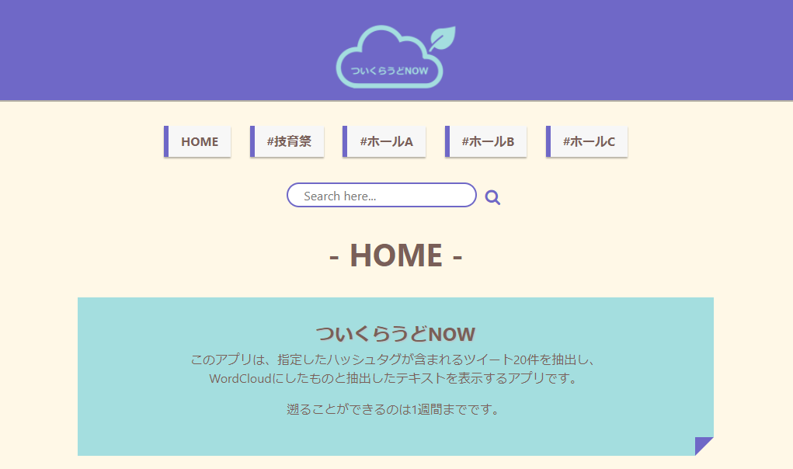
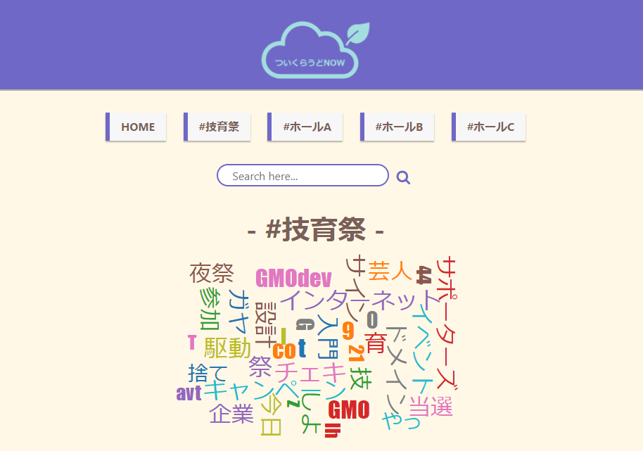
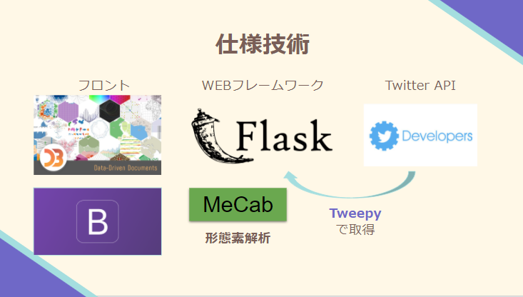

# ウインターハッカソンとは

[ウインターハッカソン](https://talent.supporterz.jp/events/28d759c2-50b4-456d-889b-1f08abf6c053/)はサポーターズさんのハッカソンです．  
個人参加という形で開発しました．

今回のテーマは「技育祭がより楽しくなる何か」でした．[技育祭](https://talent.supporterz.jp/geeksai/2021/)とは，3/11-13 開催のオンラインテックカンファレンスです．

今回の開催期間は 2 月 27 日・28 日で，19 日~26 日はハッカソン準備期間（事前開発可）でした．

# ついくらうど NOW とは

私が制作したプロダクトは「ついくらうど NOW」です．  
<https://twicloudmokumoku.herokuapp.com/>

ついくらうど NOW はリアルタイムで指定のハッシュタグの付いたツイートを WordCloud で可視化する WEB アプリです．

技育祭では同じ時刻に複数の講演があることから，同時刻に複数の見たい講演があるユーザが，1 つの講演を見ている間に他の講演の様子をワンタッチで各ホールの様子を簡単に把握できることを目指したプロダクトとなっています．

例えば，「#技育祭」のボタンを押すことで#技育祭のハッシュタグが付いたツイート過去 1 週間分の直近 20 件を収集して WordCloud を表示します．

今回，全 26 チームのなかで最優秀賞が 1 作品，入選が 4 作品選ばれましたが，入選作品の 1 つにこの「ついくらうど NOW」が選ばれました．

テーマに対する解決策のユニークさとアプリの完成度を評価していただきました．

# 使用技術

Heroku でデプロイしました．

# こだわり

付箋のようなおしゃれなボタンを実装し，クリックすると押し込むような動きになるところが一押しポイントです．

また，API のキーをべた書きしないことを学び，環境変数として扱うよう実装しました．

# 学んだこと

TwitterAPI の扱い方，自然言語処理(形態素解析)を Web アプリに組み込むということ

# 資料

プレゼン資料：<https://docs.google.com/presentation/d/1wXUX-UTri69jCA_oG5shsWIKsHgLz6SOLZfJ8HBZo4k/edit#slide=id.p>

GitHub: <https://github.com/NatsukiH/tweet_cloud>

ブログは後日書きます．
