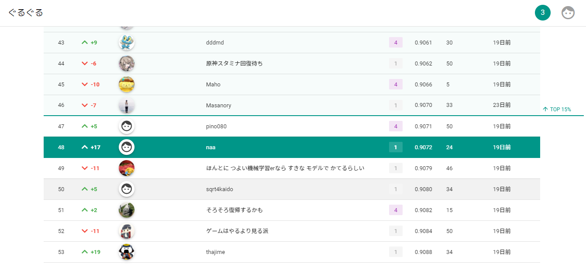

# 概要

今回，人生で初めてデータコンペに挑戦しました．  
2020/12/04 から 2020/12/13 で開催されていた[#8 [初心者向け] atmaCup](https://www.guruguru.science/competitions/13/data-sources) に参加しました．  
ゲームの情報を使って，ゲームの売上を予測するコンペでした．

# 結果

敢闘賞では 318 チーム中 48 位で，TOP15%まであと一歩という結果に終わりました．

初心者用チュートリアルとディスカッション様様ですが，初めてにしては割と頑張ったのでは？！とちょっと嬉しく思っています．

# 詳細

詳しくは note に記事を書く予定です．
