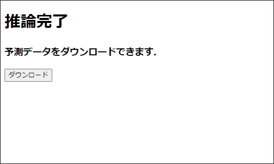

# 概要

インターンの選考課題で簡単な機械学習の WEB アプリを制作しました．  
あらかじめ求人データ(train_x.csv, train_y.csv)が与えられており，テストデータ(test_x.csv)をアップロードすると応募数を予測し，
その予測データをダウンロードできる WEB アプリです．  
https://evening-hamlet-30040.herokuapp.com/

アップロード画面  

ダウンロード画面  

# Github リポジトリ

Github の README にも概要などを書いています．  
Github リポジトリ：<https://github.com/NatsukiH/first_predict_app>
