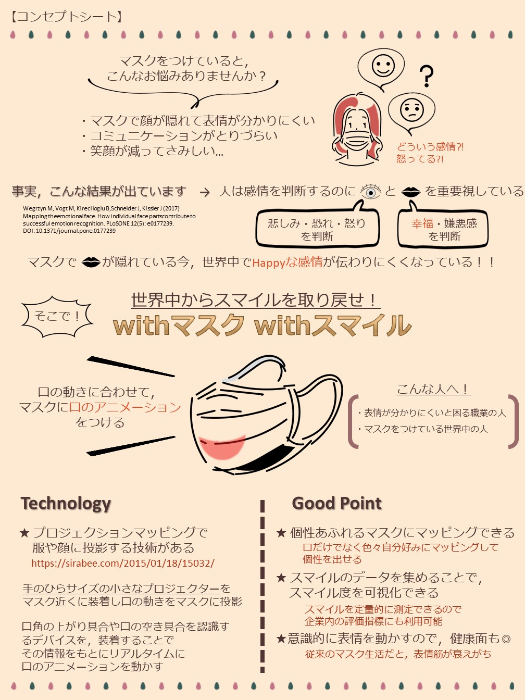

# 概要

[Mask×Technology これからのマスクを考えるアイデアコンペティション](https://lodge.yahoo.co.jp/pr/mask/)に応募し，総エントリー 128 件の中の 25 作品に選ばれ，一次審査を突破しました．

# コンセプトシート

提出したコンセプトシートはこちらになります．

# ブログ

詳しくはこちらのブログにまとめています．  
https://note.com/_naa_/n/n4c7ebd61cacd

# 資料

私の作品のページ：  
https://lodge.yahoo.co.jp/pr-mask-works/022.html
